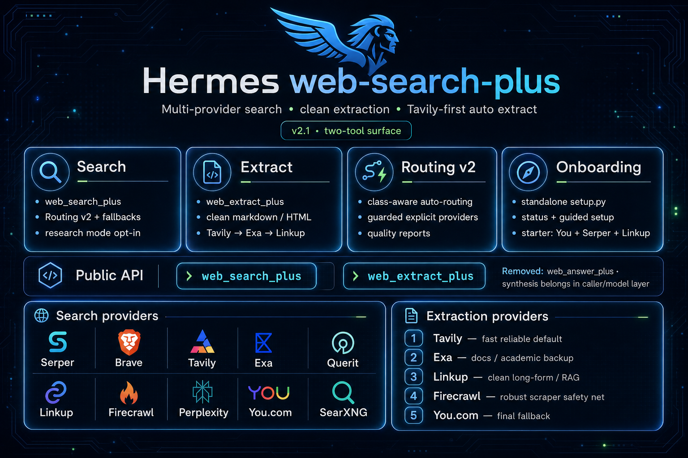

# web-search-plus — Hermes Plugin


<p align="center">
  
</p>

<p align="center">
  <a href="LICENSE"></a>
  
  
</p>

**Web search and URL extraction for Hermes — now with Routing v2: benchmarked, class-aware auto-routing across the providers your keys can actually support.** `web_extract_plus(provider="auto")` defaults to Tavily-first extraction for fast, reliable fetches; Exa, Linkup, Firecrawl, and You.com remain fallback paths when available.

`web-search-plus` adds two Hermes tools:

- `web_search_plus` — routed multi-provider web search with quality diagnostics
- `web_extract_plus` — clean URL extraction via provider backends

> Ported from [web-search-plus-plugin](https://github.com/robbyczgw-cla/web-search-plus-plugin) for the [Hermes Agent](https://github.com/NousResearch/hermes-agent) plugin API.

---

## Why this exists

Most web-search tools fail in one of two boring ways: they hard-code a single provider, or they pretend every user has every API key. This plugin is capability-based instead:

- **No global required key.** Configure one search-capable provider and search works.
- **Extraction is additive.** Add Linkup, Firecrawl, Tavily, Exa, or You.com for URL extraction.
- **Routing v2 is conservative.** You.com, Serper, Exa, Firecrawl, Tavily, and Linkup form the default search pool; Brave, SerpBase, Querit, and Perplexity/Kilo stay explicit/guarded unless opted in.
- **Costs stay bounded.** Research mode caps provider work and keeps partial results when extraction fails.

---

## Quick Start

```bash
# 1) Install and enable the Hermes plugin
hermes plugins install robbyczgw-cla/hermes-web-search-plus --enable

# 2) Configure provider keys with the standalone setup wizard
python ~/.hermes/plugins/web-search-plus/setup.py status
python ~/.hermes/plugins/web-search-plus/setup.py setup

# Bare setup prompts every supported provider; press Enter to skip what you do not have.
# Fast starter preset if you want the short path:
# python ~/.hermes/plugins/web-search-plus/setup.py setup --preset starter
# YOU_API_KEY=...      # fast Routing v2 core provider
# SERPER_API_KEY=...   # reliable Google-like fallback
# LINKUP_API_KEY=...   # clean extraction

# 3) Restart/reload Hermes so plugin tools are registered
# CLI: exit and start `hermes` again, or use /reset in-session
# Gateway/Telegram: /restart, then /reset

# 4) Optional shell smoke test
cd ~/.hermes/plugins/web-search-plus
python3 search.py --query "Hermes Agent latest release" --provider auto --quality-report
```

Notes:

- Plugin install clones into `~/.hermes/plugins/web-search-plus`.
- Keys are written to the active Hermes environment file by the setup helper; they should never be committed to the repo.
- Python 3.8+ is required. Normal Hermes plugin installation handles runtime dependencies; manual development can use `python3 -m pip install -r requirements.txt` inside the Hermes/plugin environment.

---

## Documentation

- [User Guide](docs/USER_GUIDE.md) — detailed setup, provider tuning, routing, extraction, reliability, and cost controls.
- [FAQ](docs/FAQ.md) — common setup, SerpBase auto-allow, provider selection, cache, quota, and troubleshooting questions.
- [Architecture](docs/ARCHITECTURE.md) — plugin boundary, routing engine, auto-allow gate, cache/cooldown state, data flow, and provider-extension notes.

---

## CLI setup

The setup wizard is intentionally nicer than “paste keys and pray”:

```bash
python ~/.hermes/plugins/web-search-plus/setup.py status
python ~/.hermes/plugins/web-search-plus/setup.py list
python ~/.hermes/plugins/web-search-plus/setup.py setup
python ~/.hermes/plugins/web-search-plus/setup.py setup --preset starter --open
python ~/.hermes/plugins/web-search-plus/setup.py setup you linkup --env-path ~/.hermes/.env
```

Presets:

- default / `all` — prompt every supported provider; Enter skips missing keys.
- `starter` — You.com + Serper + Linkup; best Routing v2 first-run setup.
- `lean` — You.com + Linkup; small fast search + extraction pairing.
- `search` — You.com + Serper + Exa + Firecrawl + Tavily + Linkup; full default Routing v2 pool.
- `extract` — Firecrawl + Linkup + Exa + Tavily; extraction-heavy setup.
- `all` — prompt for every supported provider.

The CLI never prints secret values. It writes keys into the active Hermes `.env` file, then reminds you to restart Hermes or run `/reset` so the tools re-register.

### Routing preferences

Key setup and routing behavior are separate on purpose: secrets live in `.env`; provider behavior lives in `config.json`.

```bash
# Show provider/key status and routing preferences
python ~/.hermes/plugins/web-search-plus/setup.py status --json
python ~/.hermes/plugins/web-search-plus/setup.py config show --json

# Prefer one fixed provider instead of auto-routing
python ~/.hermes/plugins/web-search-plus/setup.py config set-default you

# Turn auto-routing back on
python ~/.hermes/plugins/web-search-plus/setup.py config set-routing on

# Tune auto-routing order and fallback
python ~/.hermes/plugins/web-search-plus/setup.py config set-priority you,serper,exa,firecrawl,tavily,linkup
python ~/.hermes/plugins/web-search-plus/setup.py config set-fallback serper
python ~/.hermes/plugins/web-search-plus/setup.py config disable perplexity
python ~/.hermes/plugins/web-search-plus/setup.py config enable perplexity
python ~/.hermes/plugins/web-search-plus/setup.py config set-auto-allow serpbase off
python ~/.hermes/plugins/web-search-plus/setup.py config set-auto-allow serpbase on
python ~/.hermes/plugins/web-search-plus/setup.py config set-threshold 0.45

# Preview changes without touching disk
python ~/.hermes/plugins/web-search-plus/setup.py config set-default you --dry-run
```

Notes:

- `set-default <provider>` disables auto-routing and makes `--provider auto` resolve to that provider.
- `set-routing on` restores query-based routing while keeping the saved default for later.
- `set-priority` accepts comma-separated provider names, normalizes case/whitespace, and ignores duplicates with a warning.
- `set-auto-allow <provider> off` keeps a configured provider available for explicit calls while preventing auto-routing/fallback from selecting it. Brave, SerpBase, Querit, Perplexity, and Kilo Perplexity default to `off` here.
- `setup.py --config-path /path/to/config.json` points the helper at a custom config; `WEB_SEARCH_PLUS_CONFIG=/path/to/config.json` points `search.py` at the same file.
- `config reset --yes` backs up the existing file before writing fresh defaults.

---

## Capability model

| Capability | Unlocks | Configure at least one of |
|---|---|---|
| Search | `web_search_plus` | Brave, Serper, Tavily, Exa, Linkup, Firecrawl, Perplexity, Kilo Perplexity, You.com, SearXNG, SerpBase, or Querit |
| Extraction | `web_extract_plus` | Linkup, Firecrawl, Tavily, Exa, or You.com |
| Best starter | Search + extraction + reliable fallback | You.com + Serper + Linkup |

`setup.py status --plain` reports this directly:

```text
web-search-plus is configured. Providers: You.com, Serper, Linkup
Capabilities: search=yes, extraction=yes
```

---

## Tool overview

### `web_search_plus`

Use this when the agent needs search results and routing metadata.

```python
web_search_plus(query="Graz weather today")
# → auto-routed current-info search

web_search_plus(query="Singapore CPI latest", provider="you")
# → force You.com search

web_search_plus(query="alternatives to Notion", provider="exa")
# → semantic discovery

web_search_plus(query="compare recent reviews of turntables under 1000", mode="research", research_time_budget=45)
# → opt-in multi-provider research; keeps partial results if extraction hits errors/budget

web_search_plus(query="best bookshelf speakers under 1000", quality_report=True)
# → normal search plus routing/result-quality diagnostics
```

Parameters:

| Parameter | Type | Default | Description |
|---|---|---|---|
| `query` | string | **required** | Search query |
| `provider` | string | `"auto"` | `auto`, `serper`, `brave`, `tavily`, `exa`, `linkup`, `firecrawl`, `perplexity`, `kilo-perplexity`, `you`, `searxng`, `serpbase`, `querit` |
| `depth` | string | `"normal"` | Exa only: `normal`, `deep`, `deep-reasoning` |
| `count` | integer | `5` | Results, 1–20 |
| `time_range` | string | — | `day`, `week`, `month`, `year` |
| `include_domains` | string[] | — | Restrict search to domains |
| `exclude_domains` | string[] | — | Exclude domains |
| `quality_report` | boolean | `false` | Include routing diagnostics, provider scores, result counts, and extraction recommendation |
| `mode` | string | `"normal"` | `normal` or opt-in `research` |
| `research_time_budget` | number | `55.0` | Best-effort seconds budget for research mode |

### `web_extract_plus`

Use this when you already have URLs and want clean content.

```python
web_extract_plus(urls=["https://example.com"], provider="firecrawl")
# → extract clean markdown from a URL

web_extract_plus(urls=["https://docs.linkup.so"], provider="linkup", render_js=False)
# → Linkup fetch endpoint
```

Auto extraction currently tries Tavily, then Exa, Linkup, Firecrawl, and You.com when keys are available. Tavily is the fast reliable default; Exa is the fast docs/academic backup; Linkup stays the clean long-form/RAG fallback; Firecrawl remains the robust scraper safety net; You.com is the final fallback.

Parameters:

| Parameter | Type | Default | Description |
|---|---|---|---|
| `urls` | string[] | **required** | URLs to extract |
| `provider` | string | `"auto"` | `auto`, `firecrawl`, `linkup`, `tavily`, `exa`, `you` |
| `format` | string | `"markdown"` | `markdown` or `html` |
| `include_images` | boolean | `false` | Include image metadata when supported |
| `include_raw_html` | boolean | `false` | Include raw HTML when supported |
| `render_js` | boolean | `false` | Render JavaScript before extraction when supported |

---

## Providers

| Provider | Search | Extract | Best for |
|---|---:|---:|---|
| You.com | ✅ | ✅ | Fast Routing v2 core for current, multilingual, LLM-ready search |
| Serper | ✅ | — | Reliable Google-like fallback for facts, shopping, local, and news |
| Exa | ✅ | ✅ | Semantic discovery, docs, GitHub, academic/arXiv |
| Firecrawl | ✅ | ✅ | Source-first web search with scrape-ready result content |
| Tavily | ✅ | ✅ | Long-form research and content-heavy queries |
| Linkup | ✅ | ✅ | Source-backed grounding, citations, RAG-ready retrieval |
| Perplexity | ✅ | — | Native synthesized search; explicit/research-style guarded by default (`auto_allow=false`) |
| Kilo Perplexity | ✅ | — | Perplexity through Kilo gateway; explicit/research-style guarded by default (`auto_allow=false`) |
| Brave | ✅ | — | Independent web index; explicit/guarded by default (`auto_allow=false`) |
| SearXNG | ✅ | — | Privacy-focused self-hosted metasearch |
| SerpBase | ✅ | — | Cheap Google-like SERP fallback; explicit/fallback-only by default (`auto_allow=false`) |
| Querit | ✅ | — | Multilingual and real-time queries; explicit/fallback-only by default (`auto_allow=false`) |

Routing v2 is benchmarked and class-aware. It detects language/script hints and query classes such as multilingual current news, AT shopping/local, docs/API, GitHub, academic/arXiv, Reddit/community, CVE/security, official/regulatory, finance/IR, weather/local, OSS discovery, and briefing/synthesis-style searches. You.com, Serper, Exa, Firecrawl, Tavily, and Linkup are the conservative default auto-search pool. Brave, SerpBase, Querit, Perplexity, and Kilo Perplexity default to `auto_allow=false`: configure their keys to call them explicitly, or opt them into automatic routing with `setup.py config set-auto-allow <provider> on`.

---

## API keys

All provider keys are optional at install time. Configure only what you use:

```bash
# Search-capable providers
SERPER_API_KEY=***        # https://serper.dev
BRAVE_API_KEY=***         # https://brave.com/search/api/
TAVILY_API_KEY=***        # https://tavily.com — search + extraction
EXA_API_KEY=***           # https://exa.ai — search + extraction
LINKUP_API_KEY=***        # https://linkup.so — search + cheap/citation-friendly extraction
FIRECRAWL_API_KEY=***     # https://firecrawl.dev — search + extraction
PERPLEXITY_API_KEY=***    # https://perplexity.ai/settings/api
YOU_API_KEY=***           # https://api.you.com — search + extraction
SEARXNG_INSTANCE_URL=https://your-instance.example.com
SERPBASE_API_KEY=***      # https://www.serpbase.dev — explicit/fallback-only Google-like SERP search
QUERIT_API_KEY=***        # https://querit.ai — explicit/fallback-only by default

# Kilo gateway alternate provider (`provider="kilo-perplexity"`)
KILOCODE_API_KEY=***
```

---

## Reliability and cost controls

- **Provider cooldowns:** failed providers are skipped for 1 hour before retry.
- **Research budget:** `mode="research"` checks the wall-clock budget between provider calls and extraction steps.
- **Partial results:** search results already collected are preserved if extraction fails or times out.
- **Truthful warnings:** missing extraction keys, quota failures, empty results, and budget exhaustion appear in response metadata.

---

## Local development

```bash
cd ~/.hermes/plugins/web-search-plus
python3 -m pip install -r requirements.txt
python3 -m pytest -q
python3 -m compileall -q __init__.py search.py setup.py scripts tests
```

Useful smoke tests:

```bash
python3 setup.py list --json
python3 setup.py status
python3 search.py --query "Hermes Agent latest release" --provider auto --quality-report --compact
python3 search.py --query "Hermes Agent latest release" --provider brave --max-results 2 --compact
```

---

## Project layout

```text
__init__.py      Hermes plugin entry, tool schemas, handlers, answer/onboarding helpers
search.py        Provider engine, routing, caching, fallback, CLI
setup.py         Standalone provider onboarding helper
scripts/         Golden query evaluator and support scripts
tests/           Unit and regression tests
plugin.yaml      Plugin manifest
CHANGELOG.md     Version history
LICENSE          MIT license
```

---

## License

MIT — see [LICENSE](LICENSE).

## Related

- [web-search-plus-plugin](https://github.com/robbyczgw-cla/web-search-plus-plugin) — TypeScript/OpenClaw version
- [Hermes Agent](https://github.com/NousResearch/hermes-agent) — the agent runtime this plugin extends
